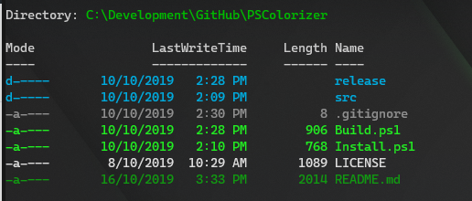

# PSColorizer
PSColorizer is a new take on [PSColor](https://github.com/Davlind/PSColor), allowing you to customise items in powershell based on your own color preferences.

PSColozier can use either standard console colors or 8 bit RGB.

## Features
* Colors can be set to RGB or Named colors from .Net (System.Drawing.Color)
* Background colors can be set
* Coloring of Files, Directories, Services, and MatchInfo (from select-string)
* Files & Directories can have rules for coloring including based the following:
  * File Names using regular expressions
  * File Attributes such as directory, hidden, system, encypted or compressed
* Theme support
* Can be unloaded/reloaded without causing issues in your current session




## Themes
There are currently 3 themes that come with PSColorizer.

### Included themes
|Theme Name| Description|
|--|--|
|Default|The default theme using standard terminal colors|
|DefaultHighColor| Similar styling to Default, but uses 8 bit RGB colors|
|Cool| Uses RGB colors to provide a theme based on whites, blues and greens|

## Comands
|Command|Description|
|---|---|
|Get-ColorizerTheme|Gets the current theme being used by PSColorizer|
|Set-ColorizerTheme|Sets the current theme for colorizer to use|
|Get-ColorizerThemes|Gets a list of all installed colorizer themes|

## Installation
### Install from source
```powershell
git clone https://github.com/JustABearOz/PSColorizer.git

sl .\PSColorizer

.\Install.ps1
```

### Install from Zip
Download the latest [release](https://github.com/JustABearOz/PSColorizer/releases) and extract it into your powershell modules directory. 

### Add to Profile
The above installation methods will load the PSColorizer module for your current session. If you want the PSColorizer module loaded for all sessions, add the following line to your profile
```pwsh
Import-Module PSColorizer
```
