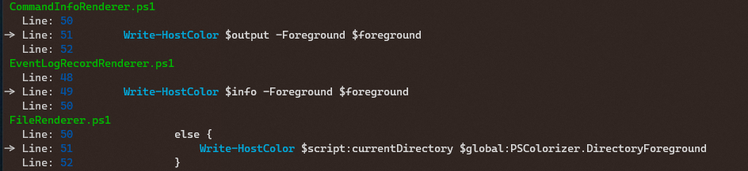

# PSColorizer
PSColorizer is a blatant ripoff of [PSColor](https://github.com/Davlind/PSColor) :), allowing you to customise items in powershell based on your own color preferences. PSColorizer works in Powershell Core and works across both Windows and Linux.

PSColozier can use either standard console colors or 8 bit RGB allowing 16 million colour goodness.

## Features
* Colors can be set to RGB or Named colors from .Net (System.Drawing.Color)
* Tested under Windows (powershell and powershell core) and Linux (Ubuntu/bash Ubuntu/powershell core)
* Support for Background colors
* Coloring of:
  * Files, Directories (ls / get-childitem)
  * Services (get-service)
  * MatchInfo (select-string)
* Files & Directories can have rules for coloring including based the following:
  * File Names using regular expressions
  * File Attributes such as directory, hidden, system, encypted or compressed
* Theme support
* Can be unloaded/reloaded without causing issues in your current session

### Screenshot of Get-Childitem


### Screenshot of Select String with -Context 1


## Themes
There are currently 3 themes that come with PSColorizer. Feel free to contribute more themes to make PSColorizer the best it can be.

### Included themes
|Theme Name| Description|
|--|--|
|Default|The default theme using standard terminal colors|
|DefaultHighColor| Similar styling to Default, but uses 8 bit RGB colors|
|Cool| Uses RGB colors to provide a theme based on whites, blues and greens|

## Comands
|Command|Description|
|---|---|
|Get-ColorizerTheme|Gets the current theme being used by PSColorizer|
|Set-ColorizerTheme|Sets the current theme for colorizer to use|
|Get-ColorizerThemes|Gets a list of all installed colorizer themes|

## Installation
### Install from source
```powershell
git clone https://github.com/JustABearOz/PSColorizer.git

sl .\PSColorizer

.\Install.ps1
```

### Install from Zip
Download the latest [release](https://github.com/JustABearOz/PSColorizer/releases) and extract it into your powershell modules directory. 

### Add to Profile
The above installation methods will load the PSColorizer module for your current session. If you want the PSColorizer module loaded for all sessions, add the following line to your profile
```pwsh
Import-Module PSColorizer
```

### Unload PSColorizer
To unload PSColorizer from your session, run the following command in powershell
```pwsh
Remove-Module PSColorizer
```

### Themes
To view a list of installed themes
```powershell
Get-ColorizerThemes
```

To set the current theme (Setting theme too Cool)
```powershell
Set-ColorizerTheme Cool
```

To view the current theme
``` Powershell
Get-ColorizerTheme
```

## Questions
### Why not contribute to PSColor?
PS Color seems to be a dead repository. There have not been any updates to the repo in a few years, and there are a few outstanding issues that have not been resolved. Yes, I could fix these issues, but there are PRs others have raised to fix some of the issues which have not been accepted in years. ALSO, I thought it would be fun to do :)
